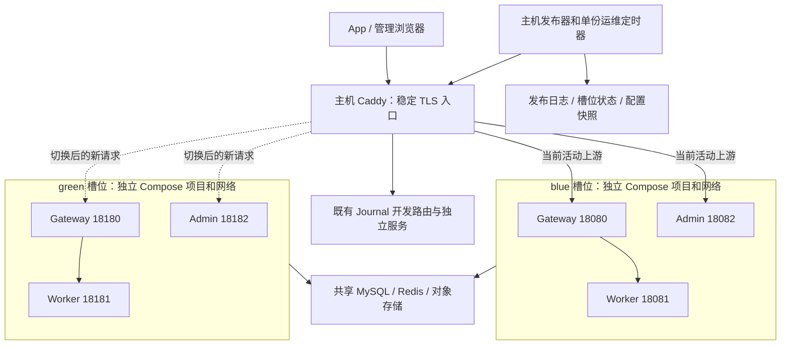

# 单机双实例与代理切换部署设计

状态：待评审的架构设计；本文不代表功能已实现或生产部署方式已变更。

## 目标与边界

同一服务器保留 blue、green 两个版本槽位，每个槽位包含 Gateway、Worker、Admin。新版本先启动并通过检查，再由原生 Caddy 把新请求切到新槽位；旧槽位继续完成已经接收的请求和任务，排空后停止。

目标是消除常规版本发布时“先停止旧容器、再启动新容器”的服务空窗，并支持可验证的版本回退。单机故障、主机重启、Caddy 进程故障、数据库故障仍会影响服务。本方案不提供跨主机高可用，也不承诺所有类型变更都能无中断发布。

两套服务只在预热、验证、排空和短时回退观察期间同时运行。数据库、Redis、对象存储和业务配额沿用现有共享资源，不复制生产数据，不因槽位切换重置额度。

## 当前基线

代码基线：`f41fd8945105d1a1827faac826a5570ea68119e3`。服务器只读核验日期：2026-09-10；下列资源数字是当时快照，发布前必须重新检查。

| 项目 | 已核验现状 | 对设计的影响 |
| --- | --- | --- |
| 主机 | 4 核，物理内存约 3.64 GiB，可用约 2.82 GiB，Swap 约 1.94 GiB | 允许评估短时两套服务并存；空闲时内存不能证明峰值承载能力 |
| 磁盘 | 40 GB，总使用约 17 GB，可用约 22 GB | 保留新旧镜像、配置和备份前检查实际剩余空间 |
| 入口 | 原生 Caddy 2.11.4；主配置导入 `/etc/caddy/tellyouwhat-backend.caddy` | 保留原有 TLS、域名与系统服务，仅原子更新受管上游配置 |
| 生产服务 | 一套 Gateway、Worker、Admin | 当前原位 Compose 更新存在容器替换空窗 |
| 其他工作负载 | 独立的 `journal-private-development` 服务 | 不纳入生产槽位，不覆盖其路由、配置或容器 |
| 内存上限 | Gateway 384 MiB，Worker 768 MiB，Admin 192 MiB | 一套合计 1,344 MiB，两套合计 2,688 MiB |
| 运维 | 主机 systemd 定时备份、巡检、维护和恢复演练 | 保持主机级单份运行，工具明确选择当前活动槽位 |

当前运行代码有三项必须解决的约束：

- [发布器](../deploy/tencent/release.py) 原位执行 `compose up`，就绪检查和[主机巡检](../deploy/tencent/ops_health.py) 固定使用 18080—18082；活动版本和回退记录目前不区分槽位。
- [Gateway](../cmd/gateway/main.go)、[Worker](../cmd/worker/main.go)、[Admin](../cmd/admin/main.go) 在收到退出信号时会取消后台上下文，HTTP 退出等待约 20 秒。现有长任务不能仅依赖容器停止宽限期保护。
- [任务派发](../internal/jobs/dispatcher.go) 可等待约 3 小时，[Prompt 评估](../internal/prompteval/engine.go) 可执行 2 小时；[语音会话](../internal/journal/voice/session.go) 包含 WebSocket。新实例启动也会启动后台循环，需要显式待命与接管机制。

## 拓扑

端口是拟定分配，实施前检查占用。所有应用端口仅绑定 `127.0.0.1`；公网继续只暴露现有 Caddy 入口。Worker 仍通过槽位内部网络访问，避免旧 Gateway 调用新 Worker 或相反的版本混用。

Compose 项目名分别固定为 `tellyouwhat-blue`、`tellyouwhat-green`。发布镜像以完整提交和镜像 digest 标识，禁止依赖可变的 `latest`。Adminctl、迁移和维护工具是一次性任务，不在两个槽位各自常驻运行。

原有 Journal `/_development/journal/*` 路由及其 18787 上游保持独立。Caddy 的域名、内部路径屏蔽、请求头处理、日志和 TLS 策略均需纳入配置差异验证。

## 发布状态与持久记录

发布器在主机上持有全流程互斥锁；发布、回退、排空清理和自动恢复共用该锁。每个阶段写入持久操作日志，重试按照已完成阶段继续，不能仅通过“容器存在”判断发布成功。

| 状态 | 新请求去向 | 后台任务 | 可执行动作 |
| --- | --- | --- | --- |
| STABLE | 当前活动槽位 | 活动槽位领取新任务 | 可准备另一个空闲槽位 |
| PREPARING | 原活动槽位 | 候选槽位禁止领取任务 | 拉镜像、备份、兼容迁移、启动候选 |
| READY | 原活动槽位 | 候选待命 | 内部检查、确认切流条件 |
| SWITCHING | 以 Caddy 实际生效配置为准 | 原槽位停止新领取；已领取任务继续 | 原子切流并核对代理与持久记录 |
| DRAINING | 新活动槽位 | 新槽位领取；旧槽位完成已有任务 | 观察、回退或等待排空 |
| STABLE | 新活动槽位 | 新活动槽位领取 | 旧槽位已停止；保留其镜像与快照用于回退 |
| RECOVERY_REQUIRED | 根据代理实况保留可用服务 | 禁止不明确的后台接管 | 对账并修复；阻止下一次发布 |

持久记录至少包含操作 ID、阶段、活动与候选槽位、前一版本、各服务 digest、配置快照摘要、迁移版本、代理路由修订号、内部与公网检查结果、切流时间、后台领取状态、排空计数和最近错误分类。记录不包含环境变量值、密钥、用户数据或交易标识。

每个槽位使用不可变的独立配置和密钥快照；更新候选配置不能改变旧槽位所挂载的文件。权限沿用现有最小权限约束，包括 Ark 管理凭据。主机管理配置与槽位应用配置分开，运维工具通过活动记录解析目标，不能继续把根目录 `.env.production` 当作唯一应用版本。

## 一次常规发布

1. **预检与加锁。** 核对当前代理路由、活动记录、实际容器和镜像；确认另一槽位已空闲。检查内存、磁盘、端口、共享依赖、配置兼容性与自动保护协议版本。有旧槽位仍在排空时拒绝下一次发布。
2. **准备候选。** 拉取全部目标镜像、校验 digest，生成候选槽位的不可变配置快照。镜像构建、仓库推送或校验失败均停止；缓存导出继续沿用可选策略。
3. **备份与迁移。** 保留现有发布前在线备份及定时备份。只允许与旧版本并行兼容的迁移，迁移只执行一次。迁移失败保留旧槽位和旧路由，不自动恢复数据库覆盖在线写入。
4. **待命启动。** 启动候选的 Gateway、Worker、Admin，所有会领取任务或产生后台副作用的循环默认暂停。检查配置解析、依赖连通、内部就绪及 Gateway 到同槽位 Worker 的路径。检查不触发真实收费模型调用。
5. **准备切流。** 暂停旧槽位新的后台领取，等待领取循环确认暂停；已领取及执行中的工作继续持有自己的任务所有权。把候选标记为可接收业务 HTTP，但后台仍待命。准备包含两个业务 API 与 Admin 上游的完整代理配置并验证。
6. **原子切流。** Caddy 一次 reload 更新 Gateway 与 Admin 上游，保持监听器与 TLS。确认实际生效路由和版本，再提交活动槽位记录。失败则恢复上一份有效路由并恢复旧槽位后台领取。
7. **接管与验收。** 新槽位获取后台领取资格，恢复生产后台循环；检查内部、公共 HTTPS 和无计费的服务路由证据。新任务应进入新槽位，旧任务仍由原任务持有者完成。
8. **排空与观察。** 旧槽位停止领取新后台工作，保留 HTTP 服务以完成切流前的请求和连接。检查错误率、延迟、队列状态和内存。初始建议观察至少 2 分钟；旧槽位活动计数连续 60 秒为零后才能停止。这些是待验证的运维默认值。
9. **完成或延续排空。** 旧槽位已停止则发布完成；有长任务时记录“新版本已上线，旧版本排空中”，由主机清理任务继续观察。不能把这两个状态合并成一个“全部完成”。保留前一版本镜像与配置，按既有保留策略清理更旧资源。

Actions 的部署步骤只等待有界的准备、切流和初步验收，不在 20 分钟作业里等待数小时任务。部署返回排空中时，在日志和运维状态中明确显示，清理完成后再写入最终状态；主机自动化失联应告警并阻止后续发布。

## 请求和后台任务的生命周期

### 排空接口

需要新增进程生命周期控制能力，至少区分：待命、允许接收 HTTP、允许后台领取、暂停后台领取、排空查询、恢复、最终停止。暂停领取不取消正在执行的任务上下文；正常排空不发送 SIGTERM。

控制接口只绑定容器内 loopback，由 `docker exec` 调用专用工具访问，不挂到公网或普通业务鉴权路径。专用工具不得复用会发起供应商调用的完整 `servicecheck --models` 流程。进程启动默认待命，只有发布器完成活动槽位核对后才能接管；容器重启也必须遵守此规则。

计数覆盖已接收 HTTP、SSE、WebSocket、已领取但尚未发出或结算的任务、后台执行任务。计数从接纳请求/领取任务之前开始，到结果持久化和费用结算完成后结束。排空计数不能只统计 Go HTTP handler，也不能只查询队列里的“执行中”。

Go HTTP Shutdown 对升级后的连接不足以承担完整排空，需要显式追踪 WebSocket 会话。断开客户端与取消供应商请求是业务语义，不能由部署器擅自改变。

### 后台工作清单

| 位置 | 工作 | 待命及切流规则 |
| --- | --- | --- |
| Gateway | Health OutboxPump、同槽位 Worker 派发 | 待命不 claim；旧实例暂停新 claim，保留已领取派发与结算 |
| Worker | HTTP 长任务 | 切流前旧 Gateway 的派发继续进入旧 Worker，完成后才计为排空 |
| Worker | Journal Prompt 评估轮询 | 待命不 claim；旧实例完成已领取评估和心跳，新实例领取未占用任务 |
| Admin | 平台巡检、AI rollout、Offer 报告同步 | 领取资格只授予活动槽位；已执行工作计入排空；共享去重规则继续生效 |
| 各服务 | 配置缓存刷新 | 可在待命时预热，不能隐含触发业务写入或计费 |
| 主机 | 备份、维护、恢复演练、健康巡检 | 单份定时器，解析活动槽位；排空清理由同一主机控制 |

后台领取资格建议使用共享租约和递增 fencing token。切流使旧 token 失去领取新任务的资格，不能使旧实例已持有的任务所有权失效。现有数据库 claim、心跳与幂等结算仍然保留；对超时任务的恢复不得把仍在健康执行的旧任务当作失联任务重新派发。

租约检查与任务领取要具有原子或等价防竞争保障；只在循环开始时检查一个内存布尔值不够。控制平面崩溃、容器自动重启或长暂停后恢复，也不能出现两个版本同时领取同一项周期性工作。

### Caddy 长连接

[Caddy reload](https://caddyserver.com/docs/command-line) 支持不停监听地加载配置；[配置 API](https://caddyserver.com/docs/api) 提供单次加载的事务语义。应用槽位状态、磁盘文件和代理运行配置仍是三个独立状态，需要发布日志对账，不能假设跨系统事务。

[Caddy reverse_proxy 文档](https://caddyserver.com/docs/caddyfile/directives/reverse_proxy) 说明配置卸载默认会关闭 WebSocket，需要显式设置 `stream_close_delay`。实施时保留现有流式刷新设置，并验证 SSE 与 WebSocket 在 reload 期间的真实表现。

`stream_close_delay` 是有限的延迟关闭保护，不能代替任务排空。实施前须核对所有语音会话的业务最长生命周期；暂按 4 小时作为压测候选值，只有确认长连接上限加排空余量小于该值后才能采用。若存在无界连接，需要先定义可恢复的应用重连协议或明确维护窗口，不能宣称 reload 永不打断连接。超过已验证上限时进入人工处置状态，不能因流水线超时自动杀旧实例。

切流不配置非幂等 POST、AI 计费调用或鉴权 nonce 请求的跨上游自动重试。新版本不健康时执行显式版本回退，不能靠代理把可能已执行的写请求重放到旧版本。

## 容量门槛

现有两套服务的内存上限总和为 2,688 MiB；另有独立开发服务上限 192 MiB，合计 2,880 MiB。相对约 3,723 MiB 的物理内存，余量约 843 MiB，要容纳操作系统、原生 Caddy、Docker 和其他主机进程。当前低负载 RSS 很低，但不能据此承诺高峰发布安全。

建议初始门槛如下，实施压测后固化配置：

- 启动候选前，`MemAvailable` 至少覆盖候选 1,344 MiB 上限加 512 MiB 运行余量，约 1.82 GiB；同时核对所有容器预算与主机保留预算。Swap 不计入可用容量。
- 峰值业务与两槽并存压测通过，确认无 OOM、持续 swap 或明显延迟退化。候选预热限速，避免迁移、备份、解压镜像和高 CPU 初始化同时堆叠。
- 拉取镜像后磁盘仍满足既有不少于 2 GB 且不少于 15% 的门槛；预留下一次备份、配置快照及部署日志空间。
- 候选启动后再次核对内存和健康状态；不足时只撤销候选准备，保留旧服务。不得为了让候选启动而停止活动槽位。

初始阈值不是容量认证。若峰值压测不通过，需要降低经验证的服务资源需求或增加单机内存；不能以无中断名义让两个 Worker 争抢不足的资源。

## 数据库、备份与回退

采用 expand/contract：本次先增加兼容字段、表或索引，旧新版本同时可读写；数据转换分批执行并验证。删除字段、收窄约束或改变不可兼容语义，只能在旧版本退出回退范围后另行发布。迁移还需评估锁表和 IO 压力，容器双实例不会消除数据库迁移导致的延迟。

继续执行现有发布前在线备份和每日定时备份。纯代码发布并不必然需要一份新备份，但当前流程的成本较低，保留统一保护可减少漏判。备份只覆盖现有允许备份的管理数据，不是全部业务数据的完整快照，不能作为所有数据丢失情形的恢复承诺。

后续若优化备份频率，应以数据库实际待执行迁移、备份新鲜度、恢复演练结果与备份范围为依据，不能仅凭 Git 中是否修改 migration 文件判断。该优化与双实例切流分开评审。

应用回退只恢复上一个兼容版本的镜像、配置、代理路由和后台领取资格；默认不回滚数据库。旧槽位仍存活时可预检后切回；旧槽位已停止时必须先以保留快照启动并通过检查，因此回退不是保证瞬时完成。保持现有自动保护协议最低版本限制。

## 故障和中断恢复

| 故障点 | 处理 |
| --- | --- |
| 镜像拉取、配置校验、资源门槛失败 | 不改变当前路由或活动服务；保留诊断并清理本次未使用候选 |
| 备份或迁移失败 | 阻止切流；保留旧服务；迁移部分成功时核对迁移账本，不盲目重放破坏性语句 |
| 候选健康检查失败 | 停止待命候选；旧版本继续服务 |
| 代理 validate/reload 失败 | 保留或恢复上一份已验证配置，核对实际路由，恢复旧后台领取资格 |
| reload 成功后、活动记录写入前崩溃 | 从受限本机代理 API 检查实际 route revision，与日志及容器对账；对账完成前阻止自动清理与下一次发布 |
| 新版本上线后业务异常 | 启动并检查旧版本（如已停止），暂停新后台领取，原子切回，恢复旧领取；失败候选已有任务仍需排空 |
| 旧槽位长时间不能排空 | 新槽位继续服务；标记排空阻塞，保留旧槽位并阻止下一次发布；查看无敏感数据的任务类型、计数和时长 |
| 活动实例意外重启 | 重启后待命；主机控制器核对路由及活动记录后恢复服务资格，不由进程自选活动身份 |
| 主机重启 | 先恢复代理与日志一致性，再恢复活动槽位；清理旧槽位须结合持久任务所有权和恢复规则，不能依赖重启前内存计数 |

代理配置验证必须覆盖最终完整 Caddy 配置。磁盘候选文件验证后用同文件系统原子替换，并保留上一份有效配置。只有 Caddy 实际加载成功且活动记录同步后才标记切流完成；失败恢复也要验证，不能仅记录“已尝试回滚”。

管理 API 仅在主机本地可用，记录中的代理修订号与实际受管上游共同用于核对。共享服务器上其他站点的有效配置必须保留，禁止以覆盖整个 Caddy 配置文件简化部署。

## 首次迁移

现有版本没有完整的待命和排空协议。首次转换不能直接采用新发布器就宣称长请求无损。

1. **运行时能力发布。** 在现有单实例方式下交付生命周期控制、工作计数、领取租约和恢复机制，保持现有业务默认可用。此步仍具有现有容器替换中断风险，应选择低流量窗口并测量影响。
2. **两槽部署演练。** 在隔离环境完成代理切换、故障注入、长连接和任务恢复测试，评估生产规格下的并存资源峰值。
3. **生产拓扑接入。** 将已具备排空能力的旧实例作为过渡槽位纳入记录；启动 blue 槽位，检查后切流，等待旧实例完成工作再退休。通过明确的过渡槽位映射处理原 Compose 项目名，不靠重命名容器或原位重建冒充无损接入。
4. **反向槽位验证。** 在下一次受控发布验证 blue → green 和回退路径，确认后台所有权、运维工具与配置快照正确；移除过渡映射后只保留两个标准槽位。

首次阶段的中断风险、拓扑接入成功、后续切流不中断验收分别报告。运行时能力发布与生产拓扑接入使用各自的 PR 和可追踪验证证据。

## 实施范围与验收

预计实现涉及 `cmd/{gateway,worker,admin,servicecheck}` 生命周期、后台任务领取协议、Compose 槽位参数、Caddy 受管上游、`release.py` 状态机、`ops_common.py` 活动槽位解析、`ops_health.py`、systemd 运维及 CI 测试。本文不修改这些文件。

先在隔离环境使用可控假服务完成下列验收；生产只执行获准的正常部署与低影响探测，不注入计费错误或更改用户预算。

| 验收 | 通过条件 |
| --- | --- |
| 连续短请求 | 切流前、中、后连续探测，记录总请求数、失败数与最长延迟；发布引入的连接失败和 5xx 为零 |
| SSE 与 WebSocket | 切流前已建立会话按协议完整结束，reload 不导致提前关闭；切流后新会话到新版本 |
| 长 AI 任务 | 旧 Gateway/Worker 完成已有任务；同一任务无重复供应商调用、无重复扣费或结算丢失 |
| 后台接管 | 待命实例无新 claim 或周期性副作用；切流后仅新槽位有领取资格，旧任务心跳继续 |
| 版本回退 | 覆盖旧槽位存活及已停止两种情况，验证恢复后的路由、任务资格、配置和数据一致性 |
| 崩溃恢复 | 在迁移后、reload 前后、状态写入前后和清理前注入中断；重复执行可对账，不误停活动实例 |
| 资源不足 | 内存不足、端口冲突、磁盘不足或旧槽位忙时发布被阻止，旧服务仍可用 |
| Schema 并行 | 同一已迁移数据库上旧新版本并行读写成功，回退仍可运行 |
| 运维与隔离 | 定时任务不重复执行；巡检标识当前槽位和排空状态；开发路由及其他站点无变化 |
| 可观测性 | 版本、槽位、阶段、耗时、请求/任务计数可核对，日志中无健康内容、Prompt、凭据或交易标识 |

就绪检查只能证明路由和依赖状态，不能替代真实 App 订阅同步、AI 请求与语音业务验收。生产上线后分别记录镜像版本、内部就绪、公网 HTTPS、实际业务以及旧槽位最终退出结果。

## 评审结论

推荐采用完整三服务版本槽位、原生 Caddy 原子切流、共享数据服务、显式任务排空及主机级发布状态机。进入实现前需要确认的技术门槛是：峰值内存并存验证、WebSocket 最长生命周期、后台领取与恢复的跨版本兼容性，以及首次运行时升级的维护窗口。它们都需要测试或运行证据，不能由架构图替代。
